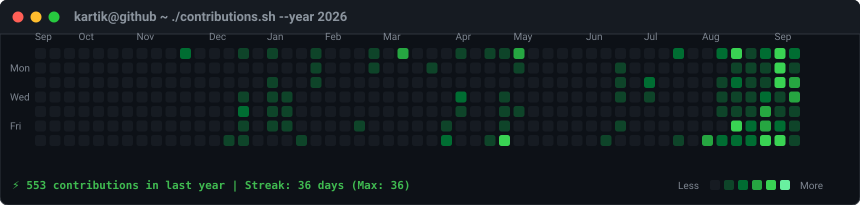

<div align="center">

# 👋 Hi there, I'm Kartik Verma! 🚀
**B.Tech CSE (Data Science) Student | Web Development & Open Source Explorer**

<br>

[](https://www.linkedin.com/in/kartik-verma-ds)
[](https://www.instagram.com/kv561287)
[](https://github.com/kartikvermagit-ds)

<br><br>

<h3><code>kartik@github ~ $ ./contributions.sh</code></h3>


<br><br>

<h3><code>kartik@github ~ $ whoami</code></h3>
<table>
  <tr>
    <td valign="top"></td>
    <td valign="top"></td>
  </tr>
</table>

</div>

---

### ⚙️ How This Profile Art Pipeline Works

- **Self-Typing ASCII Portrait (`kartik-ascii.svg`):** Prepped photo processed using OpenCV CLAHE & contrast tuning, converted into an SVG with SMIL line-by-line typing animations.
- **Terminal Info Card (`info-card.svg`):** Hand-authored SVG neofetch style card with staggered fade-in animations.
- **Live Contribution Heatmap (`contrib-heatmap.svg`):** Tokenless scraper (`fetch_contributions.py`) pulling live calendar data from `github.com/users/kartikvermagit-ds/contributions` and rendered via `render_heatmap_svg.py`.
- **Daily Refresh:** Powered by GitHub Actions (`.github/workflows/update-profile-art.yml`) running daily at 06:17 UTC.

#### 🔄 Re-generating Art Locally

```bash
# 1. Install Dependencies
pip install -r scripts/requirements.txt

# 2. Update photo (place your photo as source-photo.jpg) and regenerate ASCII SVG
python scripts/prep_photo.py source-photo.jpg
python scripts/make_ascii_svg.py

# 3. Regenerate Info Card & Heatmap
python scripts/make_info_card.py
python scripts/fetch_contributions.py
python scripts/render_heatmap_svg.py
```
