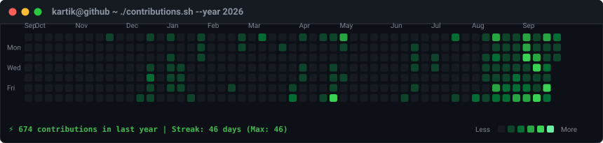

# Hi, I'm Kartik Verma 👋

### B.Tech CSE (Data Science) student · Web developer · Open-source learner

  
  
  
  

  
  

 

<table>
  <tr>
    <td width="48%" valign="top">
      <h2>About me</h2>
      
I’m a CS–Data Science student in <strong>Kanpur, India</strong> who enjoys turning ideas into clean, useful web experiences.

      <ul>
        <li>Building a stronger foundation in <strong>DSA</strong> and problem solving</li>
        <li>Exploring <strong>full-stack web development</strong> one project at a time</li>
        <li>Learning in public through projects, commits, and open source</li>
      </ul>
      
<strong>Currently focused on:</strong> JavaScript, TypeScript, Python, and shipping polished front-end projects.

    </td>
    <td width="52%" align="center">
      
    </td>
  </tr>
</table>

## Toolkit

  

  
<strong>What I use each for</strong>

   

| Area | Tools |
| --- | --- |
| Problem solving | C, data structures, recursion, algorithms |
| Web development | HTML, CSS, JavaScript, TypeScript |
| Data exploration | Python, data-focused experimentation |
| Workflow | Git, GitHub, VS Code |

## Selected work

<table>
  <tr>
    <td width="50%" valign="top">
      <h3><a href="https://github.com/kartikvermagit-ds/Data-Vista-ds-29-">📊 Data Vista</a></h3>
      
An exploration of data-focused ideas built with TypeScript and modern web tooling.

      
<code>TypeScript</code> · <code>Data Science</code>

    </td>
    <td width="50%" valign="top">
      <h3><a href="https://github.com/kartikvermagit-ds/L2_task2-weather-app">🌦️ Weather Web App</a></h3>
      
An interactive weather experience that brings forecasts and live metrics into one clear interface.

      
<code>JavaScript</code> · <code>APIs</code> · <code>CSS</code>

    </td>
  </tr>
  <tr>
    <td width="50%" valign="top">
      <h3><a href="https://github.com/kartikvermagit-ds/L2_task1-spa-project">⚡ Single-page App</a></h3>
      
A responsive, dynamic application focused on a smooth front-end experience.

      
<code>JavaScript</code> · <code>HTML</code> · <code>SPA</code>

    </td>
    <td width="50%" valign="top">
      <h3><a href="https://github.com/kartikvermagit-ds/Recursion_Kartik">🔁 Recursion & Problem Solving</a></h3>
      
Hands-on C implementations for recursion, core data structures, and algorithmic thinking.

      
<code>C</code> · <code>DSA</code> · <code>Algorithms</code>

    </td>
  </tr>
</table>

  <a href="https://github.com/kartikvermagit-ds?tab=repositories"><strong>Browse all repositories →</strong></a>

## GitHub activity

  

  
  

  

---

<i>Learning by building, improving by sharing, and moving one commit at a time.</i>

